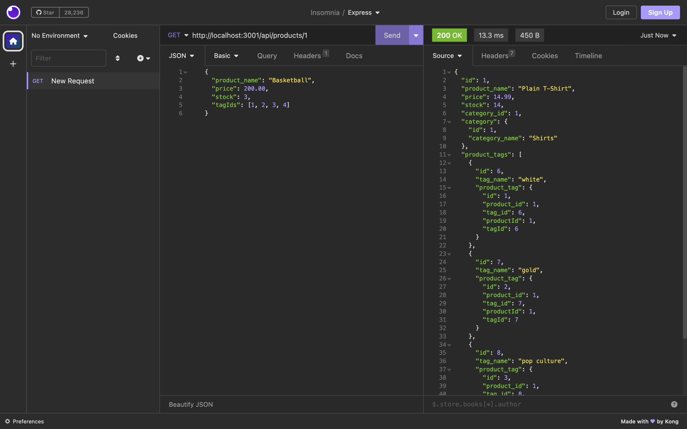

# E-commerce-backend-for-business

## Description

I was motivated to complete this project because I wanted to become a better backend developer. I built this project so a user could add view and delete different products and categories of stores items. This project will help keep track of products for bussiness.

## Table of Contents (Optional)

- [Installation](#installation)
- [Usage](#usage)
- [Credits](#credits)
- [License](#license)
- [Video](#video)

## Installation

For this project you'll need to install DOT-env, node modules, Package.son, Insomnia, Sequelize, and Express.

## Usage

Click the drop down beside Get and you'll be able to choose GET, POST, DELETE, or PUT. Enter the correct URL that you would lick to view. Click the send button and it will return your request.

## Credits

N/A

## License

MIT License

## Video

https://drive.google.com/file/d/1xS_BLJ_XlUuiP5wv49AG6t9Dy_Y3hZLJ/view
